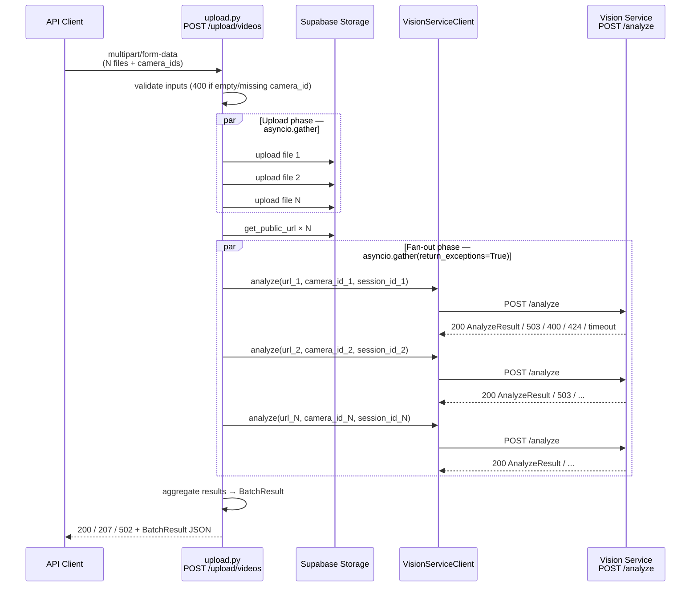

# Design Document: Vision Service Integration

## Overview

This document covers the AeroGuard **backend-side** integration with the Vision Service. The Vision
Service is an external HTTP server owned by a separate team; AeroGuard is the HTTP client. The core
problem being solved is that the existing `POST /upload/video` endpoint handles one file at a time.
We need a new `POST /upload/videos` endpoint that accepts N files, uploads them to Supabase Storage
concurrently, then fans out N parallel `POST /analyze` calls to the Vision Service — all in a single
request/response cycle.

The existing single-file endpoint (`POST /upload/video`) is left untouched.

### Scope

| In scope | Out of scope |
|---|---|
| `POST /upload/videos` batch endpoint | Vision Service internals (Requirements 1–14) |
| `VisionServiceClient` module | Vision Service `POST /analyze` implementation |
| Pydantic batch models | Supabase schema changes |
| Retry / timeout / error mapping | Dashboard / frontend changes |
| Settings for vision client config | |

---

## Architecture



### Component Map

```
aeroguard/backend/
├── routers/
│   └── upload.py              ← add POST /upload/videos (existing file, existing router)
├── services/
│   └── vision_client.py       ← NEW: VisionServiceClient
├── models/
│   └── schemas.py             ← add BatchAnalyzeRequest, BatchResultItem, BatchResult
└── .env.example               ← add VISION_SERVICE_* vars
```

---

## Components and Interfaces

### `VisionServiceClient` (`services/vision_client.py`)

A thin async HTTP client wrapping `httpx.AsyncClient`. It is the single place where the Vision
Service URL, retry policy, timeout, and error mapping live.

```python
async def analyze(
    stream_url: str,
    camera_id: str,
    session_id: str,
) -> AnalyzeResult:
    ...
```

**Behaviour contract:**

| Vision Service response | Client behaviour |
|---|---|
| HTTP 200 | Deserialize body → `AnalyzeResult`, return |
| HTTP 503 | Retry up to `VISION_SERVICE_MAX_RETRIES` with exponential back-off starting at `VISION_SERVICE_RETRY_DELAY_SECONDS`; raise `VisionServiceUnavailableError` after exhaustion |
| HTTP 400 | Raise `VisionServiceClientError(status=400, body=...)` immediately, no retry |
| HTTP 424 | Raise `VisionServiceClientError(status=424, body=...)` immediately, no retry |
| HTTP 500 | Raise `VisionServiceServerError(status=500, body=...)` immediately, no retry |
| Timeout | Raise `VisionServiceTimeoutError` after `VISION_SERVICE_TIMEOUT_SECONDS`, no retry |

**Typed exceptions** (all inherit from `VisionServiceError`):

```python
class VisionServiceError(Exception): ...
class VisionServiceClientError(VisionServiceError):   # 400, 424
    status_code: int
    body: str
class VisionServiceServerError(VisionServiceError):   # 500
    status_code: int
    body: str
class VisionServiceUnavailableError(VisionServiceError):  # 503 exhausted
    attempts: int
class VisionServiceTimeoutError(VisionServiceError): ...
```

**Retry logic (exponential back-off):**

```
attempt 0  → immediate
attempt 1  → sleep RETRY_DELAY_SECONDS * 2^0
attempt 2  → sleep RETRY_DELAY_SECONDS * 2^1
...
attempt MAX_RETRIES → sleep RETRY_DELAY_SECONDS * 2^(MAX_RETRIES-1)
raise VisionServiceUnavailableError
```

The client uses a single `httpx.AsyncClient` instance created per `analyze()` call (or injected for
testing). The `VISION_SERVICE_URL` is read from `Settings` and used as the base URL; the path
`/analyze` is appended.

---

### `POST /upload/videos` endpoint (`routers/upload.py`)

Added to the existing `upload` router. Accepts `multipart/form-data` with repeated `files` and
`camera_ids` fields (positional pairing: `files[0]` ↔ `camera_ids[0]`).

**FastAPI signature:**

```python
@router.post("/videos")
async def upload_videos(
    files: list[UploadFile] = File(...),
    camera_ids: list[str] = Form(...),
) -> BatchResult:
    ...
```

**Processing steps:**

1. Validate: `len(files) > 0`, `len(files) == len(camera_ids)`, no empty `camera_id` strings → HTTP 400
2. Upload all files to Supabase Storage concurrently via `asyncio.gather`
3. Collect public URLs
4. Generate a `session_id` (UUID) per file
5. Fan out `vision_client.analyze(url, camera_id, session_id)` for all N items via
   `asyncio.gather(*coros, return_exceptions=True)`
6. Aggregate results into `BatchResult`
7. Return with appropriate HTTP status code

**HTTP status mapping:**

| Outcome | Status |
|---|---|
| All N items succeeded | 200 |
| 1 ≤ successes < N (partial) | 207 |
| All N items failed | 502 |

---

### Settings (`settings.py` or inline in `vision_client.py`)

New environment variables added to `Settings`:

| Variable | Type | Default | Description |
|---|---|---|---|
| `VISION_SERVICE_URL` | `str` | — | Base URL of the Vision Service (already in `.env.example`) |
| `VISION_SERVICE_MAX_RETRIES` | `int` | `3` | Max 503 retries per `analyze()` call |
| `VISION_SERVICE_RETRY_DELAY_SECONDS` | `float` | `1.0` | Initial back-off delay |
| `VISION_SERVICE_TIMEOUT_SECONDS` | `float` | `30.0` | Per-request HTTP timeout |

These are read via `python-dotenv` / `os.environ` consistent with the existing pattern in the
codebase (no separate `BaseSettings` class needed unless one already exists).

---

## Data Models

Added to `models/schemas.py`:

```python
from typing import Literal, Optional
from pydantic import BaseModel

# Re-used from vision service contract
class AnalyzeResult(BaseModel):
    id: str
    camera_id: str
    incident_type: Literal["fire", "theft", "accident", "intrusion", "patrol", "animal"]
    risk_score: float          # [0.0, 1.0]
    confidence: float          # [0.0, 1.0]
    lat: float
    lng: float
    snapshot_url: Optional[str] = None


class BatchResultItem(BaseModel):
    camera_id: str
    url: str                   # Supabase public URL
    status: Literal["success", "failed"]
    result: Optional[AnalyzeResult] = None   # present when status == "success"
    error: Optional[str] = None              # present when status == "failed"


class BatchResult(BaseModel):
    items: list[BatchResultItem]
```

**Invariants enforced by construction:**
- `status == "success"` → `result` is not None, `error` is None
- `status == "failed"` → `error` is not None, `result` is None
- `len(items)` always equals the number of input `VideoUploadItem` entries

---

## Correctness Properties

*A property is a characteristic or behavior that should hold true across all valid executions of a
system — essentially, a formal statement about what the system should do. Properties serve as the
bridge between human-readable specifications and machine-verifiable correctness guarantees.*

### Property 1: Empty camera_id rejected for any batch size

*For any* batch of N ≥ 1 video files where at least one `camera_id` is an empty string (or
whitespace-only), `POST /upload/videos` SHALL return HTTP 400 and no uploads or Vision Service
calls SHALL be made.

**Validates: Requirements 15.3**

---

### Property 2: Upload-then-fan-out ordering and payload correctness

*For any* batch of N ≥ 1 valid `VideoUploadItem` entries, the endpoint SHALL call the Supabase
upload exactly N times before making any Vision Service call, and each Vision Service call SHALL
carry the `camera_id` and public URL that correspond to the same-index input item.

**Validates: Requirements 15.4, 15.5**

---

### Property 3: Fan-out failure isolation

*For any* batch of N ≥ 2 items where exactly one Vision Service call raises an exception, the
remaining N−1 calls SHALL still complete and their results SHALL appear in the `BatchResult` with
`status == "success"`.

**Validates: Requirements 15.6**

---

### Property 4: 503 retry count

*For any* configured value of `VISION_SERVICE_MAX_RETRIES = R`, when the Vision Service always
returns HTTP 503, the client SHALL attempt the call exactly R + 1 times (1 initial + R retries)
before raising `VisionServiceUnavailableError`.

**Validates: Requirements 15.7, 17.4**

---

### Property 5: Response cardinality and order preservation

*For any* batch of N ≥ 1 valid items, the `BatchResult.items` list SHALL contain exactly N entries
in the same order as the input items, regardless of which items succeeded or failed.

**Validates: Requirements 16.1, 16.8**

---

### Property 6: Result entry completeness

*For any* `BatchResultItem` with `status == "success"`, the entry SHALL contain a non-None
`result` (full `AnalyzeResult`) and a non-None `url`. *For any* `BatchResultItem` with
`status == "failed"`, the entry SHALL contain a non-None `error` string and a non-None `url`.
In both cases `camera_id` SHALL be present.

**Validates: Requirements 16.2, 16.3**

---

### Property 7: HTTP status reflects aggregate outcome

*For any* batch response: if all items have `status == "success"` the HTTP status SHALL be 200;
if at least one item has each status the HTTP status SHALL be 207; if all items have
`status == "failed"` the HTTP status SHALL be 502.

**Validates: Requirements 16.4, 16.5, 16.6, 16.7**

---

### Property 8: AnalyzeResult deserialization round-trip

*For any* valid `AnalyzeResult` object, serializing it to JSON and deserializing it back SHALL
produce an object equal to the original (no field loss or type coercion).

**Validates: Requirements 17.3**

---

### Property 9: Non-retryable errors (400 / 424) trigger exactly one attempt

*For any* Vision Service response of HTTP 400 or HTTP 424, the client SHALL make exactly one
HTTP call and raise a `VisionServiceClientError` without retrying.

**Validates: Requirements 17.5**

---

### Property 10: Timeout triggers exactly one attempt

*For any* configured `VISION_SERVICE_TIMEOUT_SECONDS`, when the Vision Service does not respond
within that duration, the client SHALL raise `VisionServiceTimeoutError` after exactly one attempt
without retrying.

**Validates: Requirements 17.6**

---

## Error Handling

### Validation errors (before any I/O)

| Condition | HTTP | Detail |
|---|---|---|
| `files` list is empty | 400 | `"At least one video file is required"` |
| `len(files) != len(camera_ids)` | 400 | `"files and camera_ids counts must match"` |
| Any `camera_id` is empty/whitespace | 400 | `"camera_id at index {i} is missing or empty"` |
| File content-type not `video/*` | 400 | `"File at index {i} must be a video"` |

### Supabase upload errors

If any Supabase upload fails, the entire request fails immediately with HTTP 500. Partial uploads
are not rolled back (Supabase Storage objects are orphaned; a separate cleanup job is out of scope).

### Vision Service call errors

Errors from individual `analyze()` calls are caught by `asyncio.gather(return_exceptions=True)` and
converted to `BatchResultItem(status="failed", error=str(exc))`. They do not propagate to the
endpoint level. The aggregate HTTP status is determined after all calls settle (Property 7).

### Unhandled exceptions

The existing global exception handler in `main.py` catches any unhandled exception and returns
HTTP 500. No changes needed there.

---

## Testing Strategy

### Dual approach

Both unit tests and property-based tests are required. Unit tests cover specific examples and
integration points; property tests verify universal correctness across randomized inputs.

### Property-based testing library

**Hypothesis** (already used in the project via `.hypothesis/` directory). Each property test
runs a minimum of **100 iterations**.

Tag format for each test:
```
# Feature: vision-service-integration, Property {N}: {property_text}
```

### Test file: `aeroguard/backend/tests/test_upload_batch.py`

**Unit tests (specific examples):**

- `test_empty_files_returns_400` — POST with zero files → 400
- `test_missing_camera_id_returns_400` — POST with one item missing camera_id → 400
- `test_all_success_returns_200` — 3 items, all vision calls succeed → 200, 3 result entries
- `test_partial_success_returns_207` — 3 items, 1 fails → 207, correct statuses
- `test_all_fail_returns_502` — 3 items, all fail → 502, all entries have error field
- `test_vision_client_503_retries` — mock returns 503 R times then 200; verify R+1 calls
- `test_vision_client_400_no_retry` — mock returns 400; verify exactly 1 call, typed exception
- `test_vision_client_timeout_no_retry` — mock raises `httpx.TimeoutException`; verify 1 call

**Property-based tests (Hypothesis):**

```python
# Property 1: Empty camera_id rejected for any batch size
@given(
    n=st.integers(min_value=1, max_value=10),
    bad_index=st.integers(min_value=0, max_value=9),
)
def test_empty_camera_id_always_400(n, bad_index): ...

# Property 2: Upload-then-fan-out ordering and payload correctness
@given(items=st.lists(video_upload_item_strategy(), min_size=1, max_size=8))
def test_upload_before_fanout_correct_payloads(items): ...

# Property 3: Fan-out failure isolation
@given(items=st.lists(video_upload_item_strategy(), min_size=2, max_size=8))
def test_one_failure_does_not_cancel_others(items): ...

# Property 4: 503 retry count
@given(max_retries=st.integers(min_value=0, max_value=5))
def test_503_retry_count(max_retries): ...

# Property 5: Response cardinality and order preservation
@given(items=st.lists(video_upload_item_strategy(), min_size=1, max_size=10))
def test_response_cardinality_and_order(items): ...

# Property 6: Result entry completeness
@given(items=st.lists(video_upload_item_strategy(), min_size=1, max_size=8))
def test_result_entry_completeness(items): ...

# Property 7: HTTP status reflects aggregate outcome
@given(outcomes=st.lists(st.booleans(), min_size=1, max_size=10))
def test_http_status_reflects_aggregate(outcomes): ...

# Property 8: AnalyzeResult round-trip
@given(result=analyze_result_strategy())
def test_analyze_result_round_trip(result): ...

# Property 9: 400/424 no retry
@given(status_code=st.sampled_from([400, 424]))
def test_non_retryable_errors_single_attempt(status_code): ...

# Property 10: Timeout no retry
@given(timeout=st.floats(min_value=0.001, max_value=5.0))
def test_timeout_single_attempt(timeout): ...
```

### Mocking strategy

- Supabase Storage calls: mock `supabase.storage.from_().upload` and `.get_public_url`
- Vision Service HTTP calls: use `httpx.MockTransport` or `respx` to intercept requests
- No real network calls in any test
